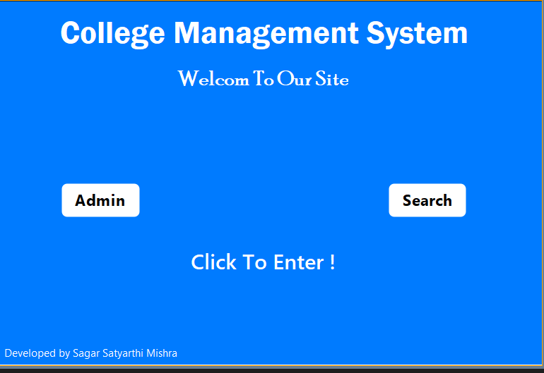
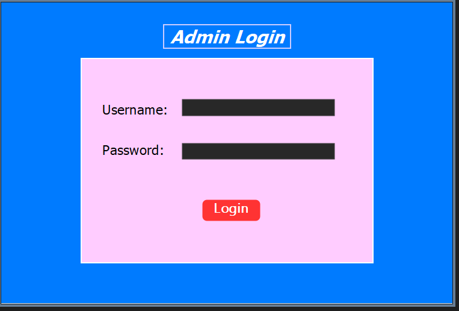
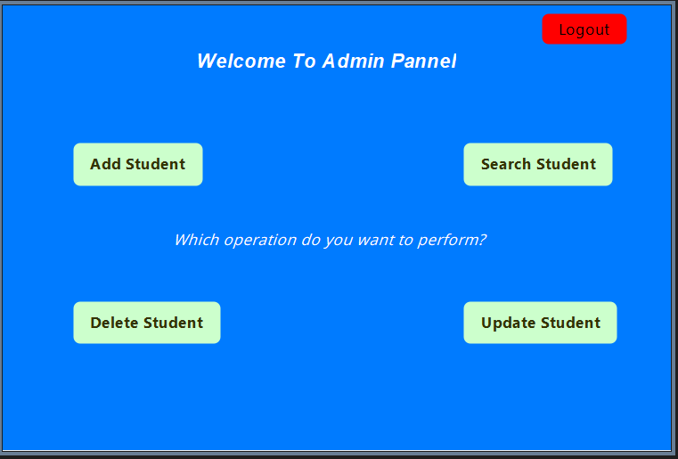
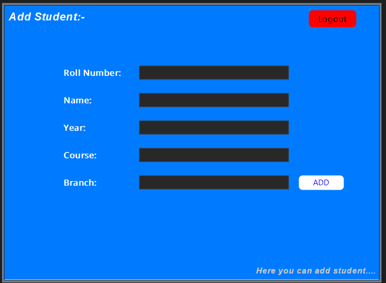
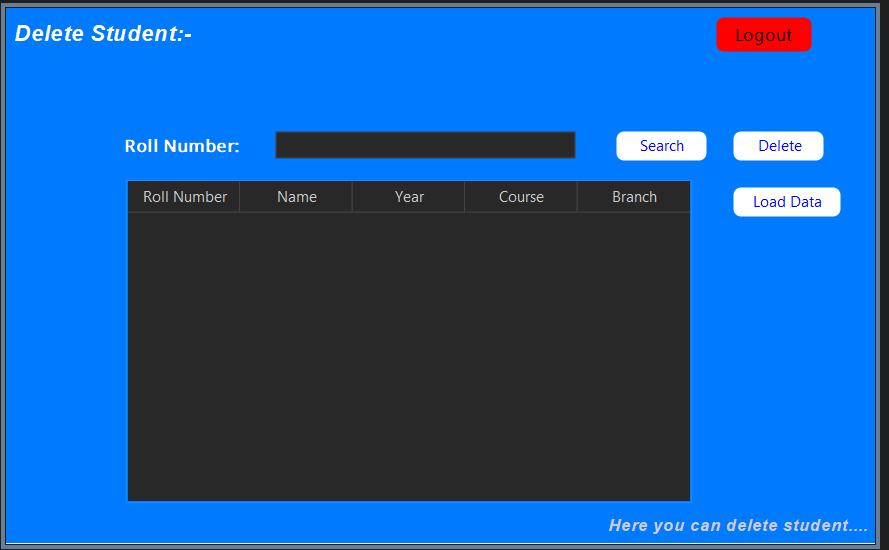
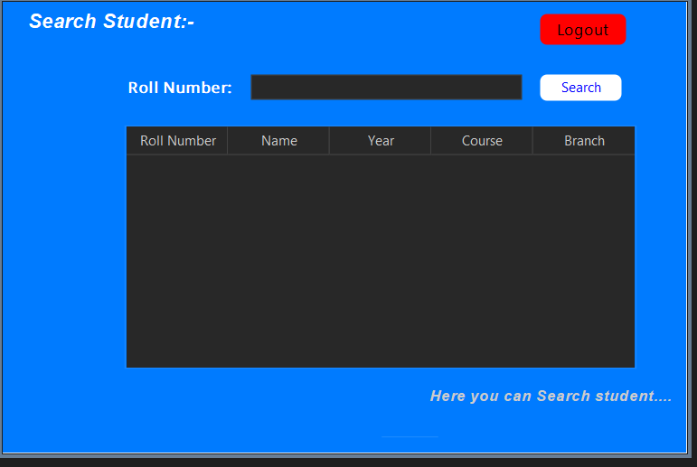
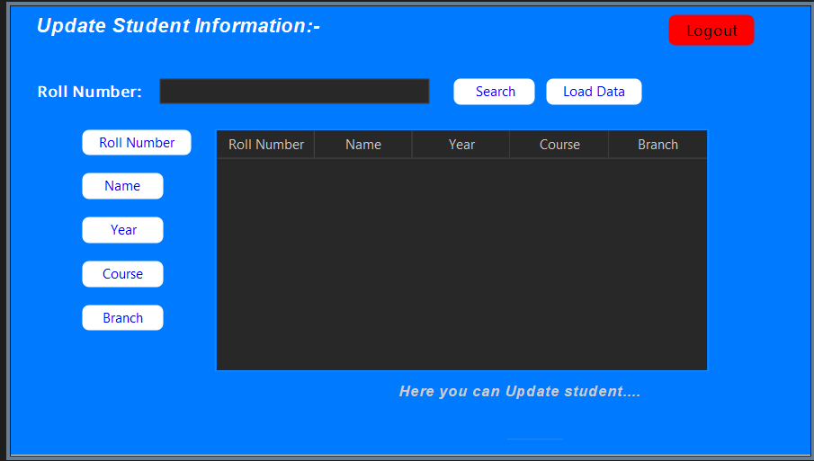

# 🎓 College Management System – Java Full Stack Project

This is a full-stack **College Management System** developed using **Java (Swing GUI)** and **MySQL**. It allows administrators to manage student records efficiently through a graphical interface.

---

## 🛠️ Tech Stack

- **Java Swing** – for building GUI components
- **MySQL** – as the relational database
- **JDBC** – for database connectivity
- **Maven** – for dependency and project management
- **NetBeans IDE** – for development

---

## 📌 Features

### 🏠 1. Welcome Page (`Welcome.java`)
- Acts as the landing screen
- Buttons: `Admin`, `Search`
- Redirects to Admin Login or Student Search

### 🔐 2. Admin Login Page (`Login.java`)
- Fields: Username, Password
- Validates admin credentials
- Redirects to Admin Dashboard (`AdminForm.java`)

### 🧑‍💼 3. Admin Dashboard (`AdminForm.java`)
- Main control panel for admins
- Functional buttons:
  - Add Student
  - Search Student
  - Delete Student
  - Update Student
  - Export as PDF
  - Logout

### ➕ 4. Add Student (`AddStudent.java`)
- Fields: Roll No, Name, Year, Course, Branch
- Adds new student record to the database

### ❌ 5. Delete Student (`DeleteStudent.java`)
- Search by Roll No
- Displays result in table
- Allows record deletion
- Load data feature to refresh list

### 🔍 6. Search Student (`SearchStudent.java`)
- Search and view student details
- Public access to lookup student data

### 📝 7. Update Student (`UpdateStudent.java`)
- Update individual student fields
- Search student first, then update
- Uses SQL `UPDATE` queries via JDBC

---

## 📸 Screenshots

### 🏠 Welcome Page


### 🔐 Admin Login


### 🧑‍💼 Admin Dashboard


### ➕ Add Student


### ❌ Delete Student


### 🔍 Search Student


### 📝 Update Student


---

## 🔧 How to Run

1. Clone the repository:
   ```bash
   git clone https://github.com/YOUR_USERNAME/CollegeManagementSystem.git
Open the project in NetBeans IDE.

Make sure MySQL is running and set up your database with the appropriate tables (create table script included below).

Update your JDBC connection details in code:
String url = "jdbc:mysql://localhost:3306/YOUR_DB_NAME";
String user = "YOUR_USERNAME";
String pass = "YOUR_PASSWORD";
Clean and Build the project.

Run the application from Welcome.java.

🗃️ Database Schema Example
CREATE TABLE student (
  roll INT PRIMARY KEY,
  name VARCHAR(100),
  year VARCHAR(20),
  course VARCHAR(50),
  branch VARCHAR(50)
);

🙋 Author
Sagar Satyarthi Mishra
📧 sagarsatyarthimishra@gmail.com
🌐 LinkedIn

⭐ Acknowledgement
This project was developed as part of my Java Full Stack learning journey. It covers CRUD operations, GUI, and JDBC connectivity with a real SQL database.

📃 License
This project is licensed under the MIT License.
MIT License

Copyright (c) 2025 Sagar Satyarthi Mishra

Permission is hereby granted, free of charge, to any person obtaining a copy
of this software and associated documentation files (the "Software"), to deal
in the Software without restriction, including without limitation the rights
to use, copy, modify, merge, publish, distribute, sublicense, and/or sell   
copies of the Software, and to permit persons to whom the Software is        
furnished to do so, subject to the following conditions:                     

The above copyright notice and this permission notice shall be included in   
all copies or substantial portions of the Software.                          

THE SOFTWARE IS PROVIDED "AS IS", WITHOUT WARRANTY OF ANY KIND, EXPRESS OR  
IMPLIED, INCLUDING BUT NOT LIMITED TO THE WARRANTIES OF MERCHANTABILITY,    
FITNESS FOR A PARTICULAR PURPOSE AND NONINFRINGEMENT. IN NO EVENT SHALL THE 
AUTHORS OR COPYRIGHT HOLDERS BE LIABLE FOR ANY CLAIM, DAMAGES OR OTHER      
LIABILITY, WHETHER IN AN ACTION OF CONTRACT, TORT OR OTHERWISE, ARISING     
FROM, OUT OF OR IN CONNECTION WITH THE SOFTWARE OR THE USE OR OTHER         
DEALINGS IN THE SOFTWARE.
